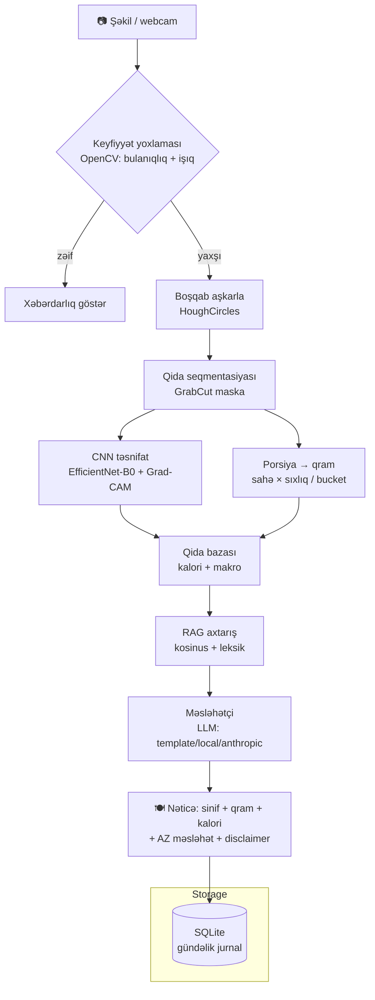

# 🍽️ FoodLens

**Şəkildən qidaya:** yemək şəklini ver → sinif, porsiya (qram), kalori/makro və
Azərbaycan dilində qida məsləhəti al. Tam **oflayn**, API açarı olmadan işləyir.

**From photo to nutrition:** give a food photo → get the class, portion (grams),
calories/macros, and nutrition advice in Azerbaijani. Runs fully **offline**, no
API key required.

> ⚠️ **Bu tibbi məsləhət deyil.** Porsiya qiymətləndirməsi təxminidir. Model
> Food-101 (əsasən Qərb yeməkləri) üzərində öyrədilib. Detallar: [Etika və
> məhdudiyyətlər](#-etika-və-məhdudiyyətlər--ethics--limitations).

---

## 🇦🇿 Layihə haqqında

FoodLens 4 real machine-learning qatını bir konveyerdə birləşdirir — heç bir
qat API "qısayolu" ilə əvəz edilməyib:

1. **Kompüter görməsi (OpenCV):** keyfiyyət yoxlaması (bulanıqlıq/işıq) →
   boşqab aşkarlanması (HoughCircles) → qida seqmentasiyası (GrabCut) →
   piksel sahəsindən qrama porsiya.
2. **CNN (PyTorch):** sıfırdan yazılmış `SimpleCNN` (baseline) + `EfficientNet-B0`
   (transfer learning). Şəffaflıq üçün **Grad-CAM** — model şəkildə nəyə baxır.
3. **NLP (sentence-transformers):** Azərbaycan dilində yemək parser/NER +
   hibrid **RAG** (kosinus + leksik) qida bazası üzərində.
4. **Məsləhətçi:** RAG konteksti ilə Azərbaycan dilində fərdi tövsiyə + gündəlik
   yekun. LLM provayderi seçilə bilir (`template` defolt — oflayn işləyir).

### Nəticələr / Results (test seti, 6 250 şəkil)

| Model | Top-1 | Top-5 | Macro-F1 | Parametr | CPU ms/şəkil |
|-------|------:|------:|---------:|---------:|-------------:|
| SimpleCNN (sıfırdan) | 0.504 | 0.843 | 0.486 | 395 801 | 11.8 |
| **EfficientNet-B0 (transfer)** | **0.923** | **0.989** | **0.922** | 4 039 573 | 21.9 |

Transfer learning baseline-ı **2 dəfədən çox** üstələyir — məhz gözlənilən nəticə.

- **NLP:** parser 20/20 doğru, RAG hit-rate 8/10 (buraxılan 2 hal `reports/nlp_eval.md`-də dürüst qeyd olunub).
- **Porsiya:** MAE ≈ 159 q, MAPE ≈ 131 % (nominal porsiyaya nəzərən — bax
  [aşağıdakı qeyd](#-etika-və-məhdudiyyətlər--ethics--limitations) və `reports/portion_validation.md`).

### 25 sinif

`pizza, hamburger, french_fries, caesar_salad, sushi, steak, fried_rice,
spaghetti_bolognese, pancakes, omelette, grilled_salmon, chicken_curry, donuts,
cheesecake, ice_cream, hot_dog, dumplings, falafel, greek_salad, lasagna, ramen,
waffles, tacos, guacamole, club_sandwich`

---

## 🏗️ Arxitektura / Architecture



**Stack:** Python · PyTorch · torchvision · OpenCV · sentence-transformers ·
FastAPI · SQLAlchemy/SQLite · Streamlit · pydantic-settings.

---

## 🚀 Necə işə salım / How to run

### Ən asan (Windows) — bir klik
Masaüstündə **FoodLens** ikonuna iki dəfə klik (və ya qovluqda `START.bat`).
venv + nutrition DB yoxlanılır, API + demo açılır, brauzer özü qalxır. Detallar: [`BASLA.md`](BASLA.md).

### Əl ilə / Manual (istənilən OS)

```bash
# 1. Asılılıqlar
pip install -r requirements.txt

# 2. Dataset + nutrition DB (Food-101 25-sinif subset)
python scripts/prepare_data.py      # Windows: .\run.ps1 data

# 3. Öyrətmə (checkpoint-lar repo-da var — bu addımı atlaya bilərsən)
python -m src.cnn.train --model simple --epochs 15 --bs 32 --num-workers 2
python -m src.cnn.train --model effnet --epochs 10 --bs 32 --num-workers 2
#   ⚠️ --mixed-precision İSTİFADƏ ETMƏ (GTX 16xx-də BatchNorm-u NaN edir, bax DECISIONS.md #11)

# 4. Qiymətləndirmə + Grad-CAM
python -m src.cnn.evaluate --gradcam 10
python -m src.cv.validate_portion

# 5. Demo
streamlit run app/streamlit_app.py   # http://localhost:8501

# 6. Testlər
pytest -q
```

> **Oflayn zəmanəti:** `LLM_PROVIDER=template` defoltdur — demo internetsiz və
> API açarı olmadan işləyir. `local` (flan-t5) və ya `anthropic` provayderi
> istəyə bağlıdır.

---

## 📁 Repo strukturu

```
config.py              # sinif siyahısı, seed=42, Settings (env-driven)
src/cv/                # quality, segment (plate+GrabCut), portion, validate_portion
src/cnn/               # models (SimpleCNN + EfficientNet), train, evaluate, predict, gradcam
src/nlp/               # meal_parser (NER), retriever (hibrid RAG), advisor, summarizer, llm
src/pipeline.py        # bütün qatları birləşdirən konveyer
app/                   # FastAPI (api.py) + Streamlit demo (streamlit_app.py)
data/                  # Food-101 subset + nutrition_db.json (25 sinif)
models/                # simple_best.pt, effnet_best.pt (repo-ya daxildir)
reports/               # metrics.json, confusion matrices, gradcam/, portion_validation.md
notebooks/results.ipynb
tests/                 # 40 test (38 keçir, 2 checkpoint tələb edir)
```

---

## ⚖️ Etika və məhdudiyyətlər / Ethics & Limitations

- **Tibbi məsləhət deyil.** Hər çıxış disclaimer daşıyır. Fərdi pəhriz üçün həkimə/diyetoloqa müraciət et.
- **Porsiya təxminidir.** Tək şəkildən monokulyar kütlə qiymətləndirməsi
  yaxşı-müəyyən problem deyil: `reference_g` Food-101-də **çəkilmiş həqiqi
  kütlə deyil**, nominal porsiyadır — buna görə MAE/MAPE "nominal ilə uyğunluğu"
  ölçür, fiziki xətanı yox. Hər qram qiyməti `confidence` bayrağı ilə gəlir.
- **Dataset qərəzi.** Food-101 əsasən Qərb yeməkləridir; Azərbaycan mətbəxi
  (qutab, dolma, plov və s.) 25 sinifdə yoxdur → belə şəkillərdə model səhv edəcək.
- **Bir boşqab = bir yemək.** Çox-yeməkli boşqab aşkarlanması gələcək iş kimi qeyd olunub.
- **Reproduktivlik.** Bütün seed-lər 42. Nəticələr `reports/` qovluğunda.

---

## 🇬🇧 English summary

FoodLens is a university AI-Engineering capstone that chains four genuine ML
layers — **OpenCV** computer vision (quality gate → HoughCircles plate detection
→ GrabCut segmentation → area-to-grams portioning), a **PyTorch CNN** stage
(from-scratch `SimpleCNN` baseline vs `EfficientNet-B0` transfer, with Grad-CAM
explainability), an **Azerbaijani NLP** stage (meal-parser/NER + hybrid cosine-
plus-lexical RAG over a nutrition knowledge base), and an **advice generator**
with a swappable LLM provider (`template` default so the demo runs fully
offline). Serving is via FastAPI + SQLite, with a Streamlit demo. On the
6 250-image test set EfficientNet-B0 reaches **92.3 % top-1 / 0.922 macro-F1**,
versus 50.4 % for the from-scratch baseline. All user-facing text is in
Azerbaijani; every output carries a not-medical-advice disclaimer. Limitations
(approximate portioning, Food-101 Western-food bias, single-dish assumption) are
measured and documented honestly rather than hidden.

---

*Seeds fixed at 42 · `LLM_PROVIDER=template` default · not medical advice.*
